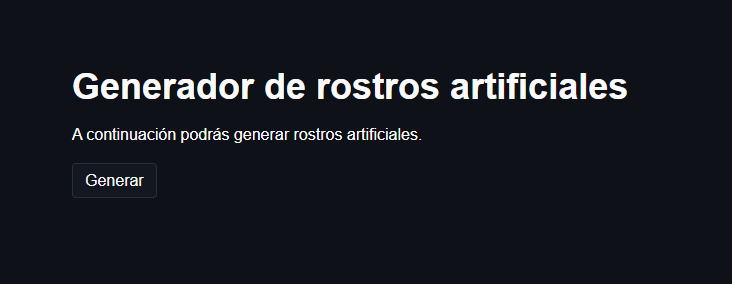
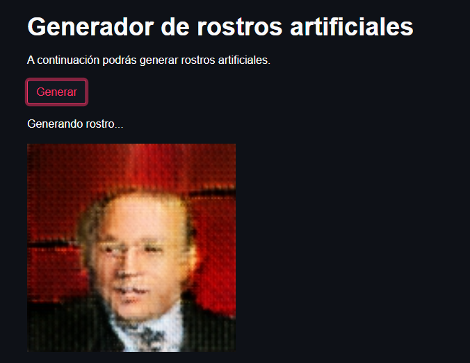

---

# Fake faces

Utilizando una arquitectura GAN se creó un Generador de rostros artificiales.

El proyecto incluye una plataforma que permite generar rostros artificiales y
descargarlos en tu equipo.

---

## Construcción del proyecto

Para este proyecto se utilizaron las siguientes herramientas:

* [Streamlit](https://streamlit.io/) - Framework web usado
* [Tensorflow](https://www.tensorflow.org/) - Librería para desarrollar modelos de ML.

---

## Instalación

Para iniciar el proyecto es necesario instalar las dependencias de la siguiente forma:

```
pip install -r requirements.txt
```

Al finalizar la instalación ejecutamos la aplicación con el siguiente comando:

```
streamlit run main.py
```

_Luego de iniciada la plataforma podrás generar rostros artificiales._

---

## Probar la plataforma

Al iniciar la plataforma podrás generar imágenes de rostros artificiales.



Al presionar en el botón _"Generar"_ aparecerá una imagen artificial de un rostro generada
aleatoreamente.



_Repitiendo este proceso, podrá generar todos los rostros que desee._

---

## Comentarios finales

* Actualmente las imágenes generadas son de 128x128. Con más potencia y tiempo se podría
diseñar un modelo capaz de generar imágenes más realistas y con mayor resolución.

---

## Autor

* **Argenis Gómez** - *Desarrollo del proyecto* - Github: [argenis-gomez](https://github.com/argenis-gomez)

---